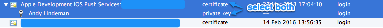
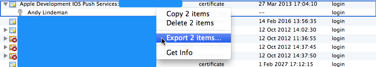

# Grocer

[](https://rubygems.org/gems/grocer)
[](https://codeclimate.com/github/grocer/grocer)
[](https://travis-ci.org/grocer/grocer)
[](https://gemnasium.com/grocer/grocer)

**grocer** interfaces with the [Apple Push Notification Service](http://developer.apple.com/library/mac/#documentation/NetworkingInternet/Conceptual/RemoteNotificationsPG/ApplePushService/ApplePushService.html) to send push notifications to iOS devices.

There are other gems out there to do this, but **grocer** plans to be the cleanest, most extensible, and friendliest.

## Important Note

iOS 9.0 (and subsequent versions) introduced a subtle change to the way push tokens are provided.

If you delete and then re-install an application the push token is invalidated and a new push token is generated.
This is important because the [Feedback service](#feedback) does not deliver the list of invalidated tokens quickly enough to prevent you from using the now invalidated token.

There is currently a [bug in grocer (#14)](https://github.com/grocer/grocer/issues/14) that will cause the APNS socket connect to hang up and fail to send subsequent notifications when one of these invalid tokens is used.

This bug combined with the change to push tokens in iOS results in varied reliability of push notification delivery.
This may or may not affect you, but if you are seeing a large amount of undelivered notifications - specifically when sending multiple messages in quick succession - it is likely that you are coming up against this.

We are looking for help [moving over to Apple's HTTP/2 notification API](https://github.com/grocer/grocer/issues/104) which should address this situation.
The current maintainer doesn't have time to do this work, but please leave us a note if you would like to drive the effort.

## Supported Rubies

* Ruby/MRI 2.x
* JRuby (latest)

### Probably-supported Rubies

* Rubinius 2 & 3

In truth, it's become hard to keep TravisCI building Rubinius versions, so we're officially removing it from our build pipeline.
Things *probably* work, but if things break, feel free to keep both pieces.

## Installation

Add this line to your application's Gemfile:

```ruby
gem 'grocer'
```

If you are using JRuby, you will also need to add this to enable full OpenSSL support:

```ruby
gem 'jruby-openssl'
```

## Usage

### Connecting

```ruby
# `certificate` is the only required option; the rest will default to the values
# shown here.
#
# Information on obtaining a `.pem` file for use with `certificate` is shown
# later.
pusher = Grocer.pusher(
  certificate: "/path/to/cert.pem",      # required
  passphrase:  "",                       # optional
  gateway:     "gateway.push.apple.com", # optional; See note below.
  port:        2195,                     # optional
  retries:     3                         # optional
)
```

#### Notes

* `certificate`: If you don't have the certificate stored in a file, you can pass any object that responds to `read`.
  Example: `certificate: StringIO.new(pem_string)`
* `gateway`: Defaults to different values depending on the `RAILS_ENV` or `RACK_ENV` environment variables.
  If set to `production`, defaults to `gateway.push.apple.com`, if set to `test`, defaults to `localhost` (see [Acceptance Testing](#acceptance-testing) later), otherwise defaults to `gateway.sandbox.push.apple.com`.
* `retries`: The number of times **grocer** will retry writing to or reading from the Apple Push Notification Service before raising any errors to client code.

### Sending Notifications

```ruby
# `device_token` and either `alert` or `badge` are required.
#
# Information on obtaining `device_token` is shown later.
notification = Grocer::Notification.new(
  device_token:      "fe15a27d5df3c34778defb1f4f3880265cc52c0c047682223be59fb68500a9a2",
  alert:             "Hello from Grocer!",
  badge:             42,
  category:          "a category",         # optional; used for custom notification actions
  sound:             "siren.aiff",         # optional
  expiry:            Time.now + 60*60,     # optional; 0 is default, meaning the message is not stored
  identifier:        1234,                 # optional; must be an integer
  content_available: true,                 # optional; any truthy value will set 'content-available' to 1
  mutable_content:   true                  # optional; any truthy value will set 'mutable-content' to 1
)

pusher.push(notification) # return value is the number of bytes sent successfully
```

It is desirable to reuse the same connection to send multiple notifications, as is recommended by Apple.

```ruby
pusher = Grocer.pusher(connection_options)
notifications.each do |notification|
  pusher.push(notification)
end
```

#### Custom Payloads

The Apple documentation says "Providers can specify custom payload values outside the Apple-reserved aps namespace."
To specify a custom payload, set `Grocer::Notification#custom`.

```ruby
notification = Grocer::Notification.new(
  device_token: "...",
  alert:        "Hello from Grocer",
  custom: {
    "acme2": ["bang", "whiz"]
  }
)

# Generates a JSON payload like:
# {"aps": {"alert": "Hello from Grocer"}, "acme2": ["bang", "whiz"]}
```

#### Passbook Notifications

A `Grocer::PassbookNotification` is a specialized kind of notification which does not require any payload.
That is, you need not (and *[Apple explicitly says not to](http://developer.apple.com/library/ios/#Documentation/UserExperience/Conceptual/PassKit_PG/Chapters/Updating.html#//apple_ref/doc/uid/TP40012195-CH5-SW1)*) send any payload for a Passbook notification.
If you do, it will be ignored.

```ruby
notification = Grocer::PassbookNotification.new(device_token: "...")
# Generates a JSON payload like:
# {"aps": {}}
```

#### Newsstand Notifications

Grocer also supports the special Newsstand 'content-available' notification.
`Grocer::NewsstandNotification` can be used for this.
Like `Grocer::PassbookNotification`, it is a specialized kind of notification which does not require any payload.
Likewise, anything you add to it will be ignored.

```ruby
notification = Grocer::NewsstandNotification.new(device_token: "...")
# Generates a JSON payload like:
# {"aps": {"content-available":1}}
```

#### Safari Notifications

Grocer can be used for [Safari Push Notifications](https://developer.apple.com/notifications/safari-push-notifications/) introduced in Mavericks.

```ruby
notification = Grocer::SafariNotification.new(
  device_token: '...',        # required
  title: 'Hello from Grocer', # required
  body: 'Hi',                 # required
  action: 'Read',             # optional; the label of the action button
  url_args: ['arg1']          # required (array); values that are paired with the placeholders inside the urlFormatString.
)
```

Generates a JSON payload like:

```json
{
  "aps": {
    "alert": {
      "title": "Hello from Grocer",
      "body": "Hi",
      "action": "Read"
    },
    "url-args": [ "arg1" ]
  }
}
```

### Feedback

```ruby
# `certificate` is the only required option; the rest will default to the values
# shown here.
feedback = Grocer.feedback(
  certificate: "/path/to/cert.pem",       # required
  passphrase:  "",                        # optional
  gateway:     "feedback.push.apple.com", # optional; See note below.
  port:        2196,                      # optional
  retries:     3                          # optional
)

feedback.each do |attempt|
  puts "Device #{attempt.device_token} failed at #{attempt.timestamp}"
end
```

#### Notes

* `gateway`: Defaults to `feedback.push.apple.com` **only** when running in a production environment, as determined by either the `RAILS_ENV` or `RACK_ENV` environment variables.
  In all other cases, it defaults to the sandbox gateway, `feedback.sandbox.push.apple.com`.
* `retries`: The number of times **grocer** will retry writing to or reading from the Apple Push Notification Service before raising any errors to client code.

### Acceptance Testing

Grocer ships with framework to setup a real looking APNS server.
It listens on a real SSL-capable socket bound to localhost.
See the [Connecting Notes](#notes) above for details.

You can setup an APNS client to talk to it, then inspect the notifications the server received.

The server simply exposes a blocking queue where notifications are placed when they are received.
It is your responsibility to timeout if a message is not received in a reasonable amount of time.

For example, in RSpec:

```ruby
require 'timeout'

describe "apple push notifications" do
  before do
    @server = Grocer.server(port: 2195)
    @server.accept # starts listening in background
  end

  after do
    @server.close
  end

  specify "As a user, I receive notifications on my phone when awesome things happen" do
    # ... exercise code that would send APNS notifications ...

    Timeout.timeout(3) {
      notification = @server.notifications.pop # blocking
      expect(notification.alert).to eq("An awesome thing happened")
    }
  end
end
```

## Device Token

A device token is obtained from within the iOS app.
More details are in Apple's [Registering for Remote Notifications](http://developer.apple.com/library/mac/#documentation/NetworkingInternet/Conceptual/RemoteNotificationsPG/IPhoneOSClientImp/IPhoneOSClientImp.html#//apple_ref/doc/uid/TP40008194-CH103-SW1) documentation.

The key code for this purpose is:

```objective-c
- (void)applicationDidFinishLaunching:(UIApplication *)app {
   // other setup tasks here....
   [[UIApplication sharedApplication] registerForRemoteNotificationTypes:(UIRemoteNotificationTypeAlert | UIRemoteNotificationTypeBadge | UIRemoteNotificationTypeSound)];
}

- (void)application:(UIApplication *)app didRegisterForRemoteNotificationsWithDeviceToken:(NSData *)devToken {
    NSLog(@"Got device token: %@", [devToken description]);

    [self sendProviderDeviceToken:[devToken bytes]]; // custom method; e.g., send to a web service and store
}

- (void)application:(UIApplication *)app didFailToRegisterForRemoteNotificationsWithError:(NSError *)err {
    NSLog(@"Error in registration. Error: %@", err);
}
```

## Certificate File

Login to the [iOS Provisioning Portal (App IDs)](https://developer.apple.com/account/ios/identifier/bundle).

Select your app bundle, scroll down and click "Edit."
This will bring you to a page that will allow you to setup and configure services for your app.
Scroll down until you see the service labeled "Push Notifications."
Depending on whether you’re creating a Development or Production certificate, click the appropriate "Create Certificate" button.


Follow the instructions to create a Certificate Signing Request, click "Continue," upload the CSR, and download the resulting `.cer` file.

Open the `.cer` file in Keychain Access, then expand the certificate to show both the certificate *and* the private key.
Command-select so both are highlighted:



Control click and select to export the 2 items:



Save the items as a `.p12` file.
Open a terminal window and run the following command:

```bash
openssl pkcs12 -in exported_certificate.p12 -out certificate.pem -nodes -clcerts -des3
```

You will be prompted for two password.
The first one is the password that you used when you exported the private key and certificate from Keychain Access.
The second password will be used to encrypt and lock the private key.
This will be the passphrase used when configuring **grocer** to connect to APNs.

The `certificate.pem` file that is generated can be used with **grocer**.

### Alternative way to generate certificate file (no Mac OS X required)

Generate private key and unsigned certificate:

```bash
 openssl req -nodes -newkey rsa:2048 -keyout push_private_key.pem -out push.csr
```

* Go to Apple Developer site and select [Add iOS Certificate](https://developer.apple.com/account/ios/certificate/certificateCreate.action).
* Choose *Apple Push Notification service SSL (Sandbox & Production)*.
* Upload the `push.csr` file during the *Generate your certificate* step.
* Download `aps.cer` on the next step.

Create `push.pem` file from `aps.cer` with following command:

```bash
openssl x509 -in aps.cer -inform der -out push.pem
```

Merge `push.pem` file and your private key into `certificate.pem`:

```bash
cat push.pem push_private_key.pem > certificate.pem
```

## Support Channels

[GitHub Issues](https://github.com/grocer/grocer/issues) and [Pull Requests](https://github.com/grocer/grocer/pulls) are the primary venues for communicating issues and discussing possible features.
Several of us also regularly hang out in the `#grocer` channel on Freenode; feel free to pop in and ask questions there as well.
Thanks! :heart:
